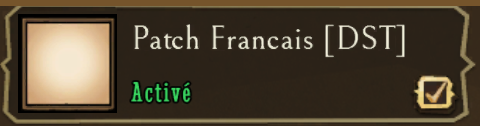
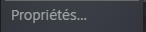
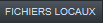
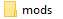
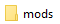

Traduction en Français pour le jeu Don't Starve Together.

### Table des matières
**[Installation](#installation)** 
**[Désinstallation](#d%C3%A9sinstallation)** 
**[Télécharger](#t%C3%A9l%C3%A9charger-la-derni%C3%A8re-version)** 
**[Statistique](#Statistique)** 
**[Contact](#contact)** 

## Installation:
1) Aller sur le steam Workshop **https://steamcommunity.com/sharedfiles/filedetails/?id=1462877774**
2) Abonner vous au mod et cliquer sur le bouton 
3) Lancer le jeu et allez dans le menu 
4) Cocher le mods 
5) Clic sûr 
6) Le jeu va redémarrer en français.

**⚠️** Si vous ne pouvait pas utiliser le steamworkshop, Utiliser la méthode manuel. **⚠️**

## Désinstallation:
1) Aller sur le steam Workshop **https://steamcommunity.com/sharedfiles/filedetails/?id=1462877774**
2) Désabonner-vous du mod et cliquer sur le bouton

**⚠️** Si vous ne pouvait pas utiliser le steamworkshop, Utiliser la méthode manuel. **⚠️**

## Télécharger la dernière version

## Installation (Manuel):
1) **[Télécharger la dernière version](../../archive/master.zip)** 
2) Dans votre bibliothèque steam faite un clic droit sur le jeu.
3) Puis un clic sur 
4) Dans l'onglet  cliquez sur 
5) Ouvrer le dossier 
6) Déposer le dossier  dans votre dossier  du jeu
7) Lancer le jeu et aller dans le menu 
8) Cocher le mods 

9) Clic sûr 
10) Le jeu va redémarrer en français.

## Désinstallation (Manuel):
1) Dans votre bibliothèque steam faite un clic droit sur le jeu.
2) Puis un clic sur 
3) Dans l'onglet  cliquez sur 
4) Ouvrer le dossier 
5) Supprimer le dossier 

## Statistique

## Contact

